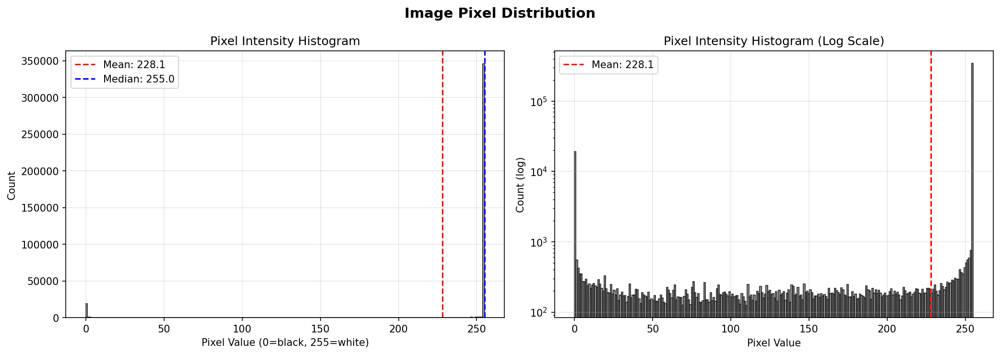
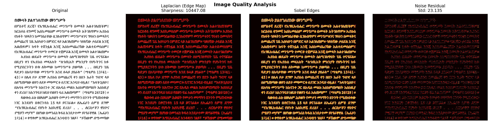
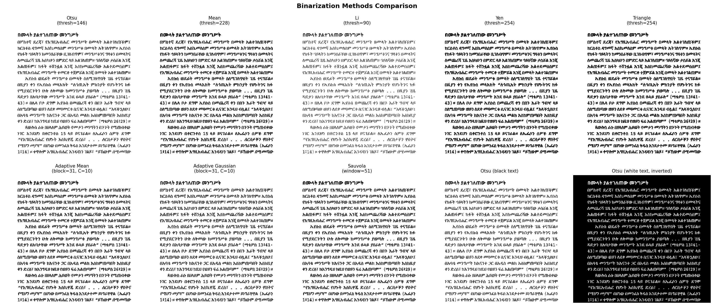
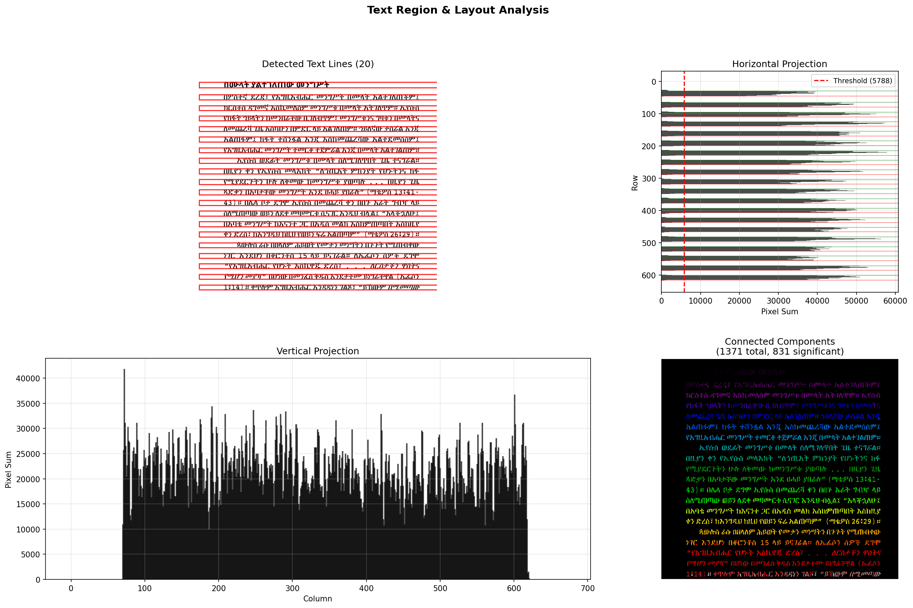
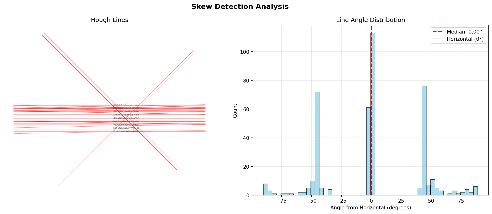

# Amharic Image Inspection Report
**Image:** `my_amharic_document.jpg`
**Generated:** 2026-05-02 17:57:24

## 1. Basic Image Properties

| Property | Value |
|----------|-------|
| Dimensions (H×W) | 622 × 670 |
| Total pixels | 416,740 |
| Aspect ratio | 1.08 |
| Dtype | uint8 |
| Channels | 1 (grayscale) / 3 (color) |
| File size (if available) | — |

## 2. Pixel Intensity Analysis

| Statistic | Value |
|-----------|-------|
| Min | 0 |
| Max | 255 |
| Mean | 228.1335 |
| Median | 255.0000 |
| Std | 70.0546 |
| Dynamic range | 255 |

- **Otsu threshold:** 146.0
- **Black pixels (≤128):** 43,743 (10.5%)
- **White pixels (>128):** 372,997 (89.5%)
## 3. Image Quality Metrics

| Metric | Value |
|--------|-------|
| Sharpness (Laplacian var) | 10447.0800 |
| Michelson Contrast | 1.0000 |
| RMS Contrast | 0.3071 |
| Noise Std (median residual) | 23.1348 |
| SNR (mean/noise) | 9.86 dB

## 4. Binarization Analysis

### Threshold Values

- **Otsu:** 146.0
- **Mean:** 228.1
- **Li:** 89.6
- **Yen:** 254.0
- **Triangle:** 254.0
- **Adaptive Mean:** block=31, C=10
- **Adaptive Gaussian:** block=31, C=10
- **Sauvola:** window=51
## 5. Text Region & Layout Analysis

- **Detected text lines:** 20
- **Image height:** 622 px
- **Avg line height:** 14.2 px (range: 14-16)
- **Avg line gap:** 15.8 px (range: 15-19)
- **Connected components (area > 20px):** 831
- **Avg component width:** 8.2 px
- **Avg component height:** 13.3 px
- **Avg component area:** 49.9 px²

## 6. Skew Detection

- **Hough lines detected:** 415
- **Median skew angle:** 0.00°
- **Mean skew angle:** 1.60°
- **Std of angles:** 40.34°
- ✅ **Image is well aligned** (no significant skew)

## 7. OCR Readiness Assessment

### OCR Readiness Score: **85/100**

| Issue | Status |
|-------|--------|
| 🟢 **Good resolution** |
| 🟢 **Good contrast** |
| 🟢 **Good sharpness** |
| 🔴 **High noise** — may cause OCR errors |
| 🟢 **Well aligned** |
| 🟢 **Text-like edges detected** (113,809 edge pixels) |

**Recommendation:**
- ✅ Image is well-suited for OCR. Proceed with confidence.
## 8. Model Compatibility Check

The CRNN model expects 64×256 grayscale images.

- **Input image:** 622×670
- **Model expects:** 64×256
- **Resize needed:** YES (will be resized to 64×256)
- **Image aspect ratio:** 1.077
- **Model aspect ratio:** 4.000
- ⚠️ **Aspect ratio mismatch (73%)** — text may be slightly distorted after resize
- ℹ️ Image is 8-bit (0-255). Will be normalized during preprocessing.