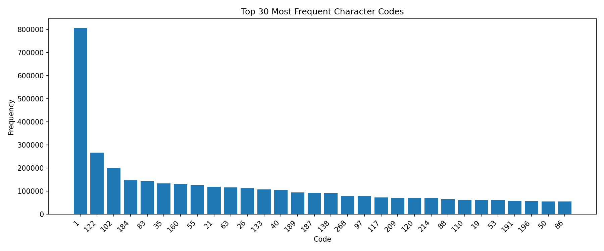
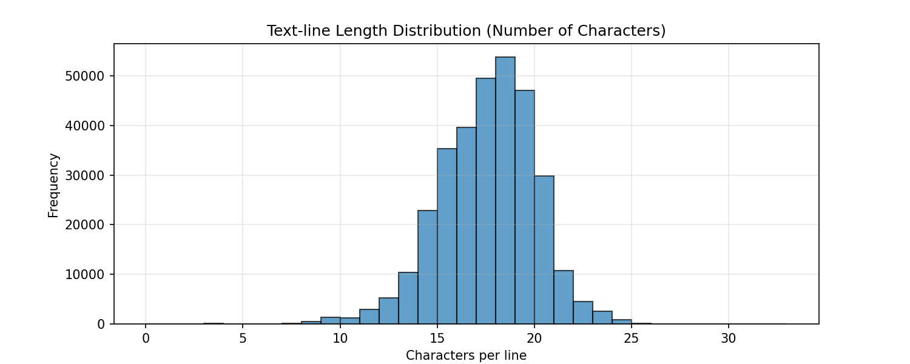
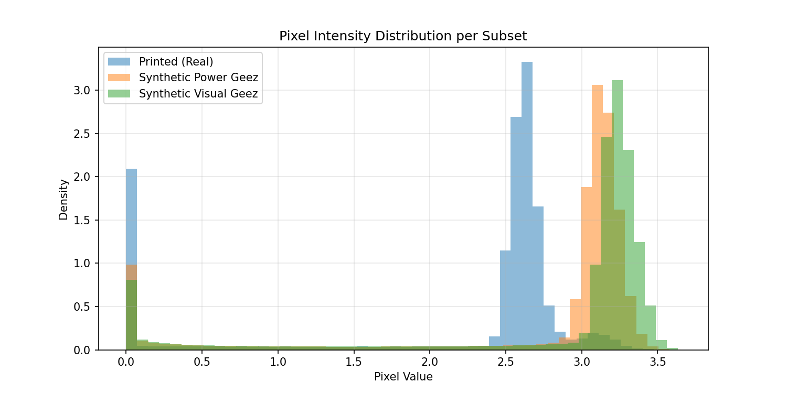
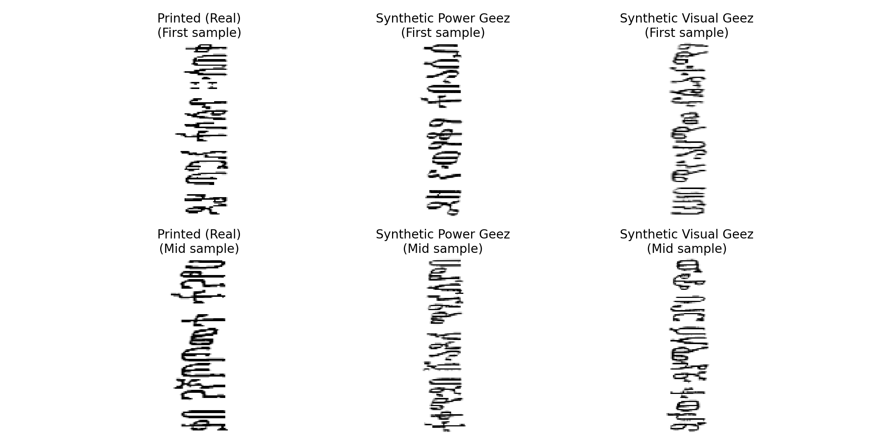
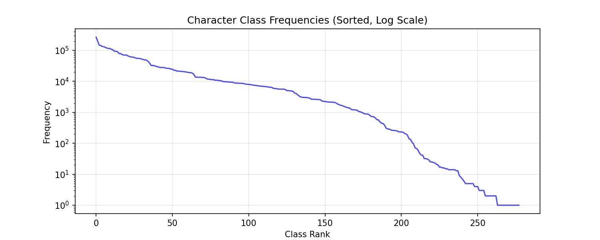

# Amharic OCR Dataset Deep Inspection Report
**Generated:** 2026-04-18 12:44:36

**Dataset shape:** X = (318706, 128, 48) (samples, height, width), y = (318706, 32)
**Data types:** X = float64, y = int64

### Subset Counts

- Printed (real): 40,929
- Synthetic Power Geez: 197,484
- Synthetic Visual Geez: 80,293

## 1. Character Set Analysis

- **Total character codes (excluding padding):** 5,452,810
- **Unique codes:** 279
- **Space character (code 1) occurrences:** 805,566
- **Character codes (excluding space):** 278
- ℹ️ No mapping file provided. Run with `--mapping` to verify Ge'ez coverage.

## 2. Label Length Distribution

- **Min length:** 3
- **Max length:** 32
- **Mean length:** 17.11
- **Median length:** 17

### CTC Time-Step Consideration

- Input image width: **128** pixels.
- With a typical CNN downsampling factor of **8**, the CTC time steps = **16**.
- Maximum label length is **32** characters.
- ⚠️ **Warning:** Max length (32) > time steps (16).
  Consider increasing input width or reducing downsampling factor.
## 3. Image Quality & Subset Comparison

**Printed (Real)** (40,929 images):
  - Mean pixel value: 2.131 ± 1.016
  - Range: [0.000, 3.363]
**Synthetic Power Geez** (197,484 images):
  - Mean pixel value: 2.681 ± 1.006
  - Range: [0.000, 3.673]
**Synthetic Visual Geez** (80,293 images):
  - Mean pixel value: 2.801 ± 1.006
  - Range: [0.000, 4.262]

## 4. Class Imbalance

- **Number of character classes:** 278
- **Median frequency:** 2970
- **Max frequency:** 267260  (code 122)
- **Min frequency:** 1
- **Imbalance ratio (max/median):** 90.0
  - ⚠️ High imbalance detected. Consider weighted loss or oversampling.

## 5. Recommendations for CRNN-CTC Training

- **Input normalization:** Pixel values are already normalized (mean ~2.64). Consider scaling to [0,1] or [-1,1] for neural network input.
- **Data augmentation:** Synthetic data shows some degradation; for real printed images, consider adding slight blur, noise, and affine transforms to improve robustness.
- **CTC configuration:**
  - Use a CNN backbone with downsampling factor ≤8 to ensure time steps ≥ max label length.
  - If using a 32‑pixel height input, typical CRNN architectures (e.g., VGG+BiLSTM) work well.
- **Character set:** With 279 unique codes, set the classification layer to **280 output units** (including CTC blank).
- **Imbalance handling:** Use a weighted CTC loss or oversample rare characters if validation performance lags on infrequent glyphs.
- **Validation split:** Reserve a portion of the real printed images for validation to measure true OCR accuracy.